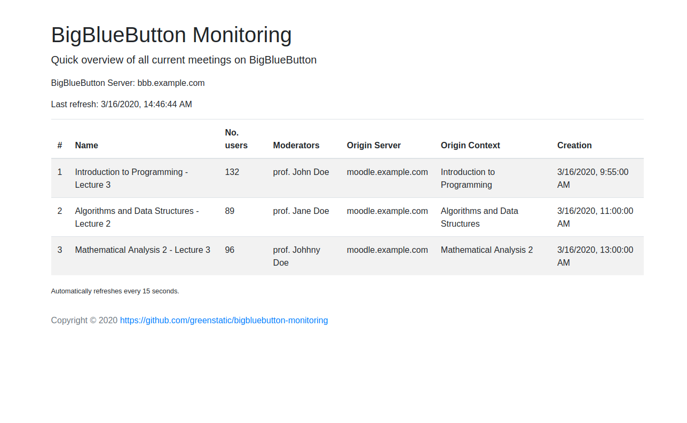

# BigBlueButton Monitoring Web App
Super simple monitoring web app for BigBlueButton that will display a list of all current meetings on your BigBlueButton server.


Required ENV variables:
* API_BASE_URL
* API_SECRET

HTTP server will listen on port: 5000

Docker Hub: [https://hub.docker.com/r/greenstatic/bigbluebutton-monitoring](https://hub.docker.com/r/greenstatic/bigbluebutton-monitoring)

## Demo Screenshot


## Installation
We assume you have docker installed and configured, as well as nginx.

```bash
docker pull greenstatic/bigbluebutton-monitoring

# Example of API BASE URL: https://bbb.example.com/bigbluebutton/api/
# API SECRET KEY can be found by SSH into BBB and running: `$ bbb-conf --secret`
docker run --name bbb-monitoring -d -p 127.0.0.1:4000:5000 --env API_SECRET=<API SECRET KEY> --env API_BASE_URL=<API BASE URL> greenstatic/bigbluebutton-monitoring


# If you wish to configure HTTP Basic Auth
sudo apt-get install apache2-utils
sudo htpasswd -c /etc/nginx/.htpasswd admin  # user: admin
# then enter password

```

Then you can proxy to the `bbb-monitoring` container running on port 4000 (localhost only).
Example nginx config with HTTP basic auth:
```
# BigBlueButton Monitoring
        location /_monitoring/ {
           auth_basic "BigBlueButton Monitoring";
           auth_basic_user_file /etc/nginx/.htpasswd;
           proxy_pass         http://127.0.0.1:4000/;
           proxy_redirect     default;
           proxy_set_header   X-Forwarded-For   $proxy_add_x_forwarded_for;
           client_max_body_size       10m;
           client_body_buffer_size    128k;
           proxy_connect_timeout      90;
           proxy_send_timeout         90;
           proxy_read_timeout         90;
           proxy_buffer_size          4k;
           proxy_buffers              4 32k;
           proxy_busy_buffers_size    64k;
           proxy_temp_file_write_size 64k;
           include    fastcgi_params;
        }
```

## Environment Variables
* API_BASE_URL
* API_SECRET
* DEBUG: - Verbose logging, useful when debugging
    * Values: true/false

## Development
```bash
# Do not forget to install requirements.txt and have the required ENV variables set!
python3 bbb-mon/server.py
```

On master push, a build job will automatically build a Docker image on Docker Hub (link to Docker Hub repoistory is above).
